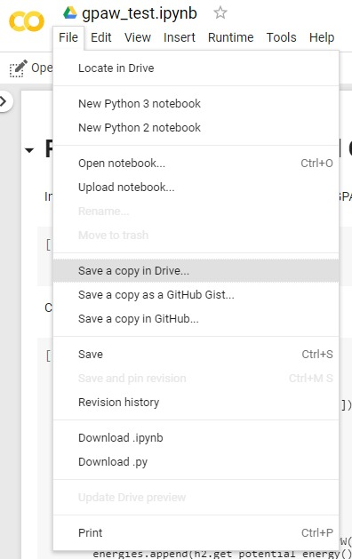

On this website I will try to guide you through the interactive part of the practical DFT lecture. Hopefully this will be interesting and useful for you!

We will be using the [Atomic Simulation Environment (ASE)](https://wiki.fysik.dtu.dk/ase/){:target="_blank"} in conjunction with the DFT code [GPAW](https://wiki.fysik.dtu.dk/gpaw/index.html).

### Google Colab ###
Both ASE and GPAW operate through Python. We will be using Google's Colab service to make it easy to follow along. No need to install Python 
locally - you only need a browser. Our code will be running in a Jupyter notebook on a Google server.<br/>
To access a Python notebook just follow one of the links and then click on <b>'File' > 'Save a copy in Drive...'</b>
<center><br/>
</center>
Once you have copied the notebook to your Google Drive you can edit, execute and work on it.

### ASE Basics ###
First, we need to install ASE and GPAW on the server (first line represses output of the notebook cell)
```bash
%%capture
!apt install ase
!apt install gpaw
```
Then we can import the necessary packages into the Python notebook
```python
from ase import Atoms #The Atoms object is used to define and work with atomic structure in ASE 
from ase.build import bulk #The ase.build module has many functions to generate solids and molecules - very handy!
from ase.io import read, write #The ase.io module is used to read and write crystal/molecular structure files
from gpaw import GPAW, PW #GPAW will be our main DFT calculator and PW is the plane wave mode
```
This has typically one of the following forms (if .module is specified only a specific module of a Python package is imported, otherwise the whole package is considered):
```python
import package.module as pm #let's you access functions/objects like so: pm.function
from package.module import object/function #imports object or function from package.module
from package.module import * #imports all functions/objects
import package.module #same
```
This is sorted from best to worst practice when it comes to importing in Python.<br/>
#### Creating our first atomic structure ###
Create. Padding. Export to cif. Could get cell parameters and atom positions.
#### Set GPAW calculator ####
Calculator with all necessary parameters.
#### Evaluate properties ####
Get potential energy


### Resources ###

1. [Atomic Simulation Environment](https://wiki.fysik.dtu.dk/ase/)
2. <font color="red">color</font>